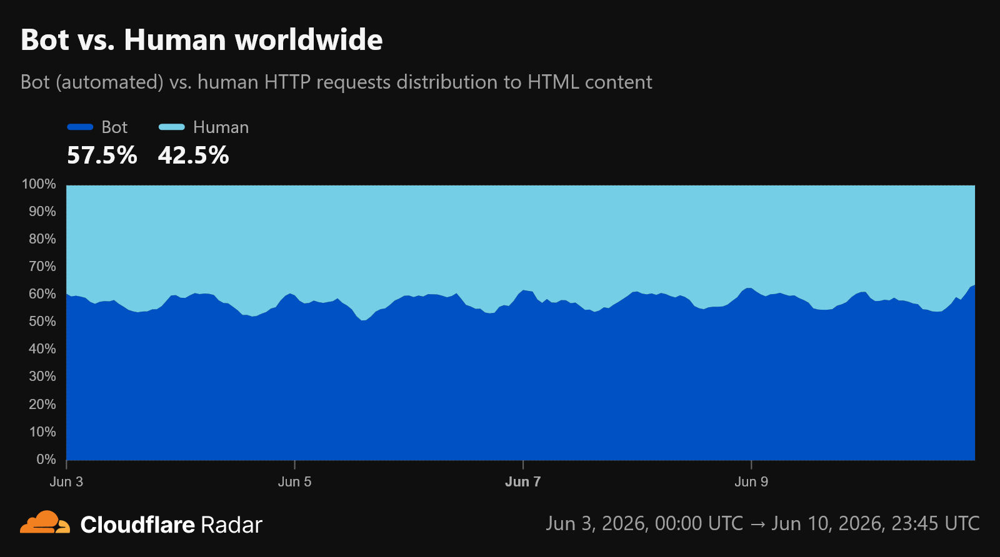

The LLMs are EVERYWHRE on the internet. People
use it for writing homework, documentation, some companies use it for charging a lot to write reports
like [Delloite](https://fortune.com/2025/10/07/deloitte-ai-australia-government-report-hallucinations-technology-290000-refund/) (6 months ago) provided a report with AI hallucinations to the Australian Government
and [KPMG](https://finance.yahoo.com/sectors/technology/articles/kpmg-drops-ai-report-false-093631620.html) pulled a report because of hallucinations in it.
This post is about how AI/LLMs are growing across the internet.

## Usage of AI

The usage of AI (mostly LLMs) has grown at a pace never experienced on the internet, in [Google I/O 2026](https://blog.google/intl/en-in/company-news/technology/sundar-pichai-io-2026/#momentum) Sundar Pichai said AI measured by token usage, has grown from 9.7 trillion tokens in May 2024 to 480 trillion and then to 3.2 Quadrillion tokens in May 2026, that's 7 fold jump from 2025 to 2026. LLM usage does not seem to be going down at any noticeable rate. This is also primarily why the cost of hardware like RAM has gone up wayy too much, LLMs require a lot of memory to hold the Embeddings, Key Value matrices, etc. Micron Technology, one of only 3 major consumer RAM suppliers shut down their consumer brand, Crucial last year to cater to serving data centres. SK Hynix, another RAM supplier, announced bonuses of \$400,000+ for it's workers due to LLM generated demand. The demand is so high that in December 2025, Samsung Semiconductor refsued to service an order made by Samsung Mobile Experience!.

> **Side Note:**
> Until Meta's Threads App came along, ChatGPT held the record of gaining 100 million Monthly Active Users the fastest, reaching it in 2 months after launch (Threads did it in 5 days). To put this in context, Tiktok took 9 months to reach 100 million and Netflix took 10 YEARS to do the same, granted they started at the very beginbing of the Internet.
> The point of this note is to show that LLM usage is not tied only to programming, which is becomming the main focus right now, even before anyone thought to generate code from an LLM, usage had blown up.

## The Data Problem

[Forbes](https://www.forbes.com/sites/joemckendrick/2026/04/14/ai-may-be-running-out-of-data-stanford-report-warns/) in this article talks about high quality training data
from the internet may be running out, a lot of synthetic data is being used now to train the LLMs, as in already trained LLMs are generating data to train new LLMs (this feels like a bad idea). This can cause somewhat of an echo chamber effect. [Epoch AI](https://epoch.ai/publications/will-we-run-out-of-data-limits-of-llm-scaling-based-on-human-generated-data) (a research non-profit) states that we may run out of human generated text between 2026 and 2032. This can be a serious problem

## Internet Traffic

Matthew Prince, CEO of Cloudflare on June 03 2026, tweeted [Bot Traffic](https://x.com/eastdakota/status/2062212701414187452), he says due to agentic systems,
for the first time in history had exceeded human traffic

Even GitHub has had problems dealing with this exponential growth in traffic, stated in April, [Github Blog](https://github.blog/news-insights/company-news/an-update-on-github-availability/). They have had multiple hour long incidents since then. Accross the web, many services have had to implement stricter rate limiting to counter this increase in AI bot crawling. GitHub are reported to be rebuilding all their infrastructure to handle this new era of coding agents.

## Cost of LLMs

The price of LLM API based token billing have decreased very much since they launched, as stated by [Epoch AI](https://epoch.ai/data-insights/llm-inference-price-trends) but
with the advent of AI Coding Agents like Cursor, Claude Code, the usage just exploded so much. Individuals can use the subscription models which are soo subsidized by providers,
like the Claude Max \$200 per month subscription can give upto \$8000 of usage (billed on API rates), same goes for the ChatGPT Pro 20x sub which is shown to give \$10,000+ usage.
These prices are insane and you will understand why when you think about what an LLM API call actually does. When you call an LLM API, actual GPUs have to take your prompt, tokenize it, run it through attention blocks, do many matrix multiplication depending on model size, etc, all of these have real costs associated and imagine all this done for all the tool calls, it's not predictable at all but everybody seems to just believe the cost will keep getting lower. There are cost controlling techniques applied like Prompt Caching, which uses cryptographic proof to check if prompt input prefixes are unmodified and loads the precomputed KV caches into GPUs, and these cached input tokens are generally billed around one tenth the cost of normal input tokens but the cache-hit rate varies a lot by provider from what I have read.

## Bad Budget Managment

People don't realise that large companies cannot manage subscriptions for dev teams through the subsidized path due compliance, data collection policies, etc. So, Anthropic offers a Team Plan and an Enterprise Plan, the Team plan allows managing upto 150 seats like subscriptions but the Enterprise Plan, which is the most used by companies other than startups, is a
complete pay for every token on API rates system, which can dramatically increase costs. Here's some examples of bad budget management that has happened this year (I think I will get the opportunity to update this list),

- [Fortune](https://fortune.com/2026/05/26/uber-coo-ai-spending-tokens-claude-code/) - Uber spent their ENTIRE YEAR'S AI Budget in 4 MONTHS, when I read this I just could not
  comprehend how that can happen, what were they even doing, the Uber app has not changed in any significant measure.
- [Yahoo Finance](https://finance.yahoo.com/sectors/technology/articles/amazon-says-shut-down-token-161016125.html) - Amazon shutdown their Internal AI leaderboard after the developers simply did as they were told to, "use more AI".
- [Meta's Leaderboard](https://x.com/Polymarket/status/2041932251080872303) - Meta also seemingly had a situation where due to gamified nature of thier leaderboard, Claudeonomics,
  led to more usage.

Also, [Github Copilot](https://github.blog/news-insights/company-news/github-copilot-is-moving-to-usage-based-billing/) switched to token based billing on June 1st, meaning when you
buy a \$20 a month Copilot subscription, you would get \$20 worth of API billing based usage, which doesn't really make sense why wouldn't you just get them directly from the provider? And there's OpenRouter as well, doesn't that provide a lot more value? It's not the most sense for capturing market share in an AI Tools loving economy but makes definitely more sense economically, clearly this was long time coming, they had already removed premium models like Opus, Sonnet, GPT-5.3-Codex from the [Copilot Student Plan](https://github.blog/news-insights/company-news/github-copilot-is-moving-to-usage-based-billing/) because they cost a lot, and were disproportionately the most used models. They had also stopped new signups in April, [Github Blog](https://github.blog/changelog/2026-04-20-changes-to-github-copilot-plans-for-individuals/)

## The Black Box Issue

## Open Source/Weight Models

## Anthropic Situation
